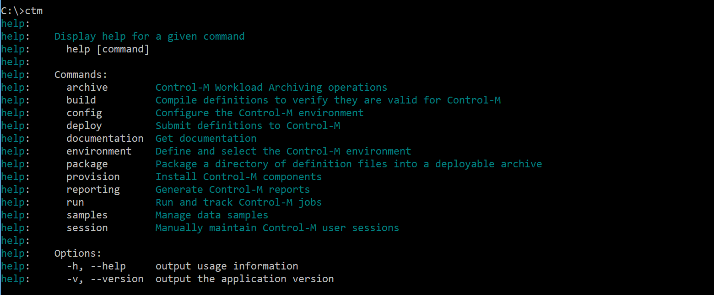

# Lab 01 - Install the Automation API CLI

This exercise will explain how to install the Automation - API

## Step 1 - Install or Upgrade Node.js

Download the Node.js Windows Installer from https://nodejs.org/en/download/. The Node.js installer includes the npm (Node Package Manager) utility.
Run the installer and follow the instructions on screen.

To verify that you have the required version of Node.js (4.x or later) and npm (3.x or later), enter the following commands into a command prompt. (The following responses are examples.)

```
>node -v
v6.2.0
>npm -v
3.8.9
```

    
Some Node.js installers include npm version 2.x or below. If you need to upgrade npm, use the following command:

```
>npm -g install npm@latest
```

## Step 2 - Download Command Line Interface (CLI)

Download a ctm-cli.tgz node package from the following location:

 https://<END_POINT>:8443/automation-api/ctm-cli.tgz

An endPoint is the URI for Control-M Automation API.

## Step 3 - Install the CLI

To install the ctm-cli.tgz node package, run cmd, and then type the following command from the directory where you saved the ctm-cli.tgz file:

```
>npm -g install ctm-cli.tgz
```


>__Note__
>
>Use the -g argument to install the package globally, so that the CLI can run from any directory and by any user.

## Step 4 - Test the CLI Installation

Run the following command through a command prompt:


## Step 5 - Set up a Control-M environment

The Control-M Automation CLI requires an environment to run the commands. An Environment is a combination of an endPoint, username, and password.

An endPoint is the URI for Control-M Automation API. The endpoint has the following format:

```
https://<END_POINT>:8443/automation-api
```

If you accessed a Control-M instance, use the following command to add an environment. In this example, the environment is named devEnvironment:

```
>ctm environment add devEnvironment "https://<END_POINT>:8443/automation-api" 
"[ControlmUser]" "[ControlmPassword]"
```


>__Note__
>
>While the environment is added, it is checked for its policy regarding certificates. If the environment is currently set to accept self-signed certificates, a warning is displayed. If you want to apply a stricter policy of accepting only certificates signed by a trusted Certificate Authority (and not accepting self-signed certificates), you can use the ctm environment configure command to set the rootCertificateRequired parameter to true.

## Step 6 - Set the environment as default

All commands invoked will use the default environment. 

The following example command shows how to set an environment named devEnvironment as your default environment. The returned response lists all existing environments.
```
>ctm environment set devEnvironment
info:    current environment: devEnvironment
info:    environments: {
  "local": {
    "endPoint": "http://localhost:48080/",
    "user": ""
  },
  "devEnvironment": {
    "endPoint": "https://<END_POINT>:8443/automation-api",
    "user": "<controlmUser>"
  }
}
```


>__Note__
>
>After setting the default environment, if you want to run API commands against a different, non-default environment, you must include the -e <environmentName> option in any API command that you run. In addition, ensure that the version of the destination environment matches the version of the CLI.

## Step 7 - Verify the setup by logging in to a session

After setting up the Control-M environment for the CLI, ensure that the user associated with the default environment can successfully log in to a CLI session. For a workbench environment, the user is named workbench. For any other Control-M environment, the user is specified during environment setup.

To log in to a CLI session, use the Session Service. The response returns the user name, a token for the session, and the version of the CLI, as shown in the following example:

```
>ctm session login
{
  "username": "emuser",
  "token": ""3B55116B9CB07443729B45311195009948827EE76CDAD54A3AA733652EE140552851BFBC25F6FB96C836A9151A05ED8FC9A9D292E0452EFC6EB1F03DFED1DDC5",
  "version": "9.18.3"
```

## Step 8 - Access documentation

You can access the REST API documentation for this environment:

```
>ctm documentation restApi
```

To access this web-based API documentation:

```
>ctm doc gettingStarted
```