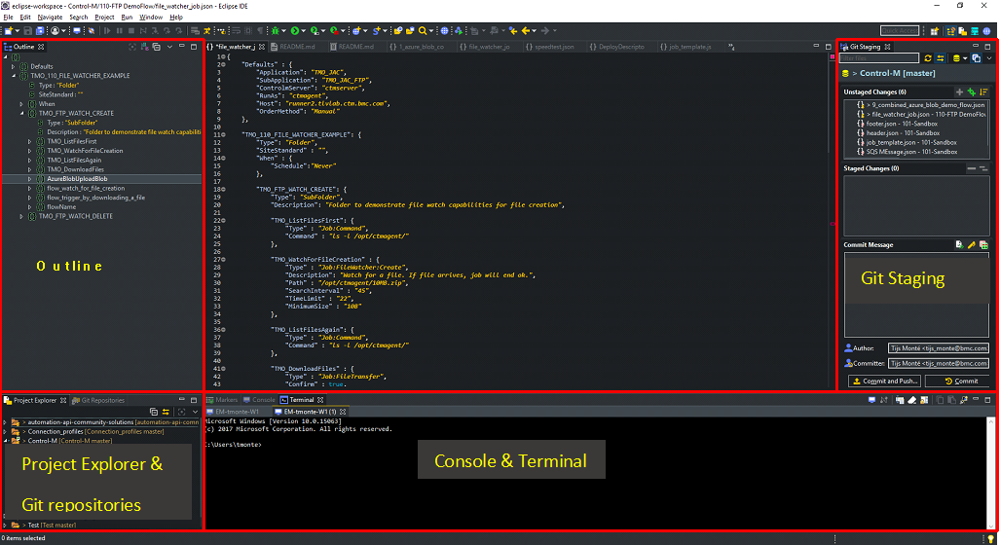
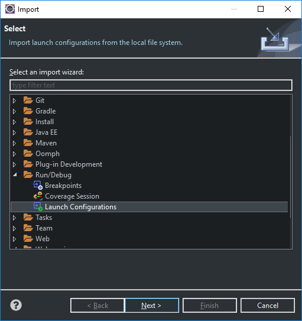
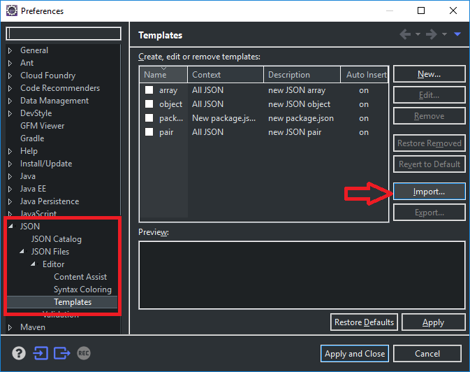
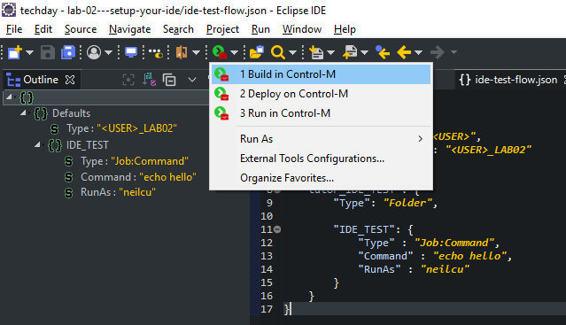

# Lab 02 - Setup your IDE

## Step 1 - Choose your IDE

For the exercise in this Lab environment, we will be primarily working with an IDE. The Labs are based on Eclipse, but it will work with any IDE. In this exercise we will provide the example for Eclipse. In case you want to setup a different IDE, please visit https://github.com/controlm/automation-api-community-solutions/tree/master/601-integration-with-ides-and-code-editors for more IDE integration examples. 

You can download the latest version of Eclipse [here](https://www.eclipse.org/)

## Step 2 - Fork this repository

In order to create your own copy of this exercise, please fork this repository to your local account.

## Step 3 - Tune your Eclipse

Feel free to tailor your Eclipse to your need, but for this exercise we recommend to use the following windows:
- Git Repositories
- Git Staging
- Projects
- Console
- Outline

Below an example how this can be configured. 



> __Note:__
>
>Whatever configuration you choose, we recommend to save it as a jobs-as-code perspective (go to __Window --> Perspective --> Save Perspective As..__)


## Step 4 - Clone this Repository to your local machine

Like any other development project, we want to clone the repository to your local machine. Please copy the url of your own version of this repo, and import it in your eclipse.

## Step 5 - Import run configuration

In order to use the Automation API directly from Eclipse, we need to setup the __External Run Configuraitons__ in Eclipse. In order to do so go to:
```
File --> Import
```

Browse to Launch Configurations (Tip: Type Launch in the search bar for quick navigation)



Select the directory __external-run-configurations__ from your local git folder for this repository.

## Step 6 - Import json templates

JSON templates can be used to quickly insert pieces of json to build workflows in jobs-as-code. In order to import the pre-defined templates, go to __Window --> Preferences
Navigate to 

__JSON Files --> Editor --> Templates__ and press __import__



Select the file [templates.xml](json-templates/templates.xml) from the __json-templates__ directory of this repository. 

Feel free to add your own templates or modiy an existing one (e.g. add a prefix for jobnames of new jobs)

## Step 7 - Other tips for using Eclipse with Jobs-as-code

You can customize Eclipse to your taste by installing additional plug-ins. The plug-ins listed below are found usefull by other jobs-as-code users:
- [Darkest theme](https://marketplace.eclipse.org/content/darkest-dark-theme) to make it look better
- [Eclipse Web Developer Tools](http://marketplace.eclipse.org/content/eclipse-web-developer-tools-0?mpc=true&mpc_state) for editing json files
- [Markdown text editor](http://marketplace.eclipse.org/content/markdown-text-editor?mpc=true&mpc_state) for editing .md files
- [Yedit](http://marketplace.eclipse.org/content/yedit?mpc=true&mpc_state) for editing YAML files

## Step 8 - Test your setup

We are almost done. Let's test our configuration:
- Open the file ide-test-flow.json in Eclipse
- __Run --> External Tools__ and choose __Build in Control-M__ or chose from the menu bar as show in the picture below:

-  You should see the following output in he Eclipse Console:

```
  {
    "deploymentFile": "ide-test-flow.json",
    "successfulFoldersCount": 0,
    "successfulSmartFoldersCount": 1,
    "successfulSubFoldersCount": 0,
    "successfulJobsCount": 1,
    "successfulConnectionProfilesCount": 0,
    "successfulDriversCount": 0,
    "isDeployDescriptorValid": false
  }
]
```