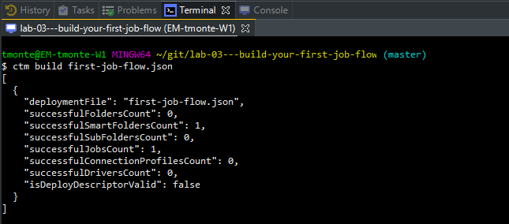

# Lab 03 - First job flow

Lab that covers the creation of a first job flow.

## Step 1 - Visit the code reference

For code reference use the [online documentation](https://docs.bmc.com/docs/display/public/workloadautomation/Control-M+Automation+API+-+Code+Reference)

Also make sure the json templates from the previous lab are working correctly.

## Step 2 - Update the json file

Replace every occurrence of the string <USER> with the user name that was assigned to you.

## Step 3 - Build and run the json file

From your IDE, build the json file.

To get familiar with the Automation API CLI, open a terminal from your eclipse, and type the following command to build the job slow manually using the automation-api cli:

- Open the (git) local terminal: 


- Type the command ``````ctm build first-job-flow.json``````




- Once the build is successful, run the the job via Eclipse or by entering command ``````ctm run first-job-flow.json``````  
The run command will return a run-id which looks similar like 51e1c002-862e-4149-b781-19242f974922
- To get the status of the run, type the command ``````ctm run status <RUN ID> ``````
- The run status command will return a json object with the status of the jobs. Each job has a job id that looks like ctmaws:000xf. Explorer the different Automation API's services by performing the following commands:
	- ```ctm run job:status::get <JOB ID>```
	- ```ctm run job:output::get <JOB ID>}```
	- ```ctm run job:log::get <JOB ID>```
	- ```ctm run job::rerun <JOB ID>```
	
- There is also a way to search for jobs without knowing the run id. You can query the active job file with the following command:

```ctm run jobs:status::get -s "folder=user*&jobname=IDE*"```

>__Note__:
>
> We are now using a plural (ctm run __jobs__:status::get) because we expect potentially multiple jobs to be returned. 

Please visit the [Service Reference](https://docs.bmc.com/docs/automation-api/9182/services-808125681.html#Services-runjobs:status::get) to learn more about the different services. 


## Step 4 - Add an extra job

Add an extra job to the flow. Please use the json templates or the code reference as mentioned in step 1.

Add a job called __"ShowFiles"__ that performs the ```ls -la``` command

## Step 5 - Move the run as user to defaults and add another job

Before we add another job, we want to set the run as attribute as part of the defaults to avoid the fact that we have to maintain that property for every single job.

- Move the run as attribute to the defaults.
- Add another command job called "PrintCurrentDirectory" that performs the ```pwd``` command

## Step 6 - Add a flow element

The jobs we added so far, are now running simultaneous once ordered. They have no dependencies to other jobs. We can add dependencies by adding a flow object.

Add an flow object by using the json templates or the code reference as mentioned in step 1.

Now lets add another job that runs in parallel with the job ShowFiles

Add a command job "WaitJob" with command ```sleep 30```

Add another flow object that let's the WaitJob run in parallel with the ShowFiles job.

By now, your job flow should look similar the the flow in file [lab-result.json](lab-result.json)

## Step 7 - Experiment with other job/folder attributes

Try to experiment with other job/folder attributes by exploring the json templates or the code reference as mentioned in step 1. Try to achieve the follow:
- Add a schedule by adding a when object to the defaults section
- Add a description for the jobs 
- Add resources
- Add more jobs
- Add more (complex) dependacies
 
 