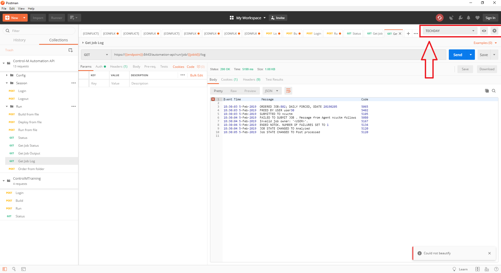
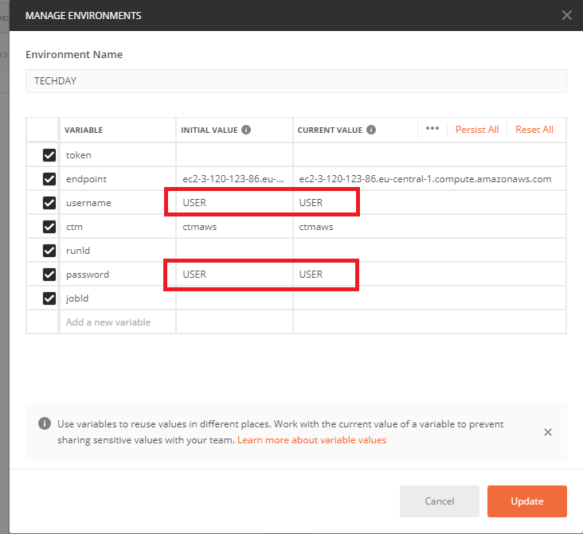
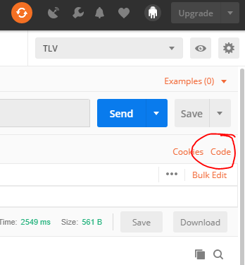
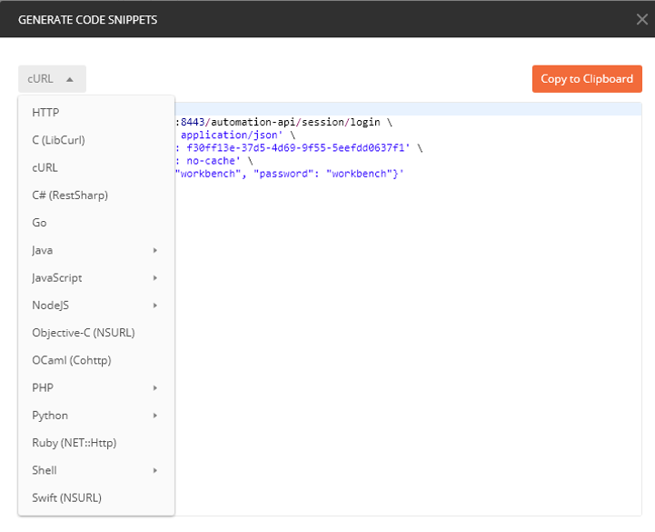

# Lab 06 - Explorer the services over REST

**What is Postman?**

The Postman Rest Client is a very popular and easy to use HTTP Request composer that makes it easy to call web services - in our case Control-M Automation API Services. 

To use Postman you have to download and install it. Please note, that there was a Chrome extension - this is not the one. Please use full version from https://www.getpostman.com/apps

## Step 1 - Import configuration

After installing you can to import provided files - TECHDAY.postman_environment.json and Control-M_Automation_API.postman_collection.json.
Once imported it will populate a list of available operations that can be selected and easily called from within the Postman UI.
It will add as well environment definition (upper right corner) - the TECHDAY one. You can copy it later on and add your own definitions to match your environments. 

## Step 2 - Update the TECHDAY environment with your credentials

After you imported the example files from Step 1, go to the environment settings and update the parameters (replace USER with your user id).

## Step 3 - Explorer the different service

From pre-populated list of actions you can call API services in Control-M AAPI. Usually you will start with Login (Session->Login), and later on pass to other different calls, 
like run a job from JSON (remember to attach file), or check the status of the job/jobs/request. 
 
 
## Step 4 - Generate code

When working with given call (like Login) you can find a code button on the right side.

When you will press this button, a window will pop up 

The Postman can generate a code in many different languages (including bash, python, etc) that will call exactly the service you have chosen. 

This can help you to quickly find the right syntax and pass all parameters to call.

 